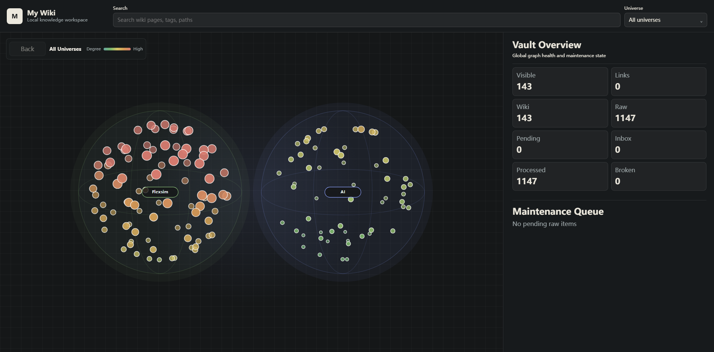

# My Wiki

**零成本、低门槛，让 AI Agent 帮你建立和维护真正属于自己的本地知识库。**

[English](README.md)


网页、PDF、截图、聊天记录、笔记和官方文档里有大量有用信息，但它们通常散落在不同地方。My Wiki 给本地 AI Agent 一个长期工作的知识空间，让 Agent 把这些资料变成你真正拥有、可以持续演化的关联 Wiki。

安装一次 Agent Skill，把知识库放在电脑任意位置，然后直接用自然语言提出需求。Agent 会完成资料入库、原始证据与图片保存、原子 Wiki 蒸馏、关系维护、知识问答，并在你想探索时打开交互式知识图谱。

默认不需要云数据库，不需要向量数据库，不要求安装 Obsidian，也不要求购买 API。

## 为什么选择 My Wiki

- **本地优先**：Markdown、网页快照和图片都保存在你控制的文件夹中。
- **Agent 自动维护**：你只需说“把这篇文章入库”或“维护知识库”，Agent 负责完成后续流程。
- **结论可追溯**：整理后的知识始终连接到原始证据，而不是只保留一段无法核实的 AI 摘要。
- **理解图片证据**：示意图、截图、图表和界面状态可以被保存，并在回答问题时一起展示。
- **内置知识图谱**：可以探索知识宇宙、Wiki 关系，以及每个 Wiki 背后的原始资料。
- **开放且可迁移**：知识就是普通文件，可以移动、备份、用任意 Markdown 编辑器打开，也可以以后接入 RAG。
- **零成本起步**：先用 Node.js 和本地 AI Agent 得到可用知识库，不必先搭一整套基础设施。

## My Wiki、RAG 和 LLM + Obsidian 有什么区别

它们解决的是知识管理的不同环节。My Wiki 重点补上经常被忽略的中间层：在检索之前，先把原始资料变成可读、有关系、证据闭环的长期知识。

| | My Wiki | 传统 RAG | LLM + Obsidian |
|---|---|---|---|
| 开始使用 | 安装一个 Skill，选择一个文件夹 | 搭建入库、切片、Embedding、召回和服务 | 安装编辑器和插件，再设计提示词与笔记规范 |
| 主要存储 | Markdown、快照和本地图片 | 向量索引加外部原文存储 | Markdown Vault |
| 谁来整理 | Agent 维护 raw 证据、原子 Wiki、关系和健康检查 | 流水线索引文本切片，可读知识需要另做 | 通常由用户整理，插件或聊天提供辅助 |
| 可追溯性 | Wiki 结论回链 raw，双向证据关系可以检查 | 取决于检索元数据和应用设计 | 可以做到，但依赖用户的笔记习惯 |
| 图片能力 | 图片作为证据保存，并可随答案输出 | 需要额外设计多模态入库与检索 | 图片保存方便，问答时选图仍需额外流程 |
| 可视化 | 内置知识宇宙、Wiki 网络和证据层 | 通常需要额外图数据库或可观测工具 | 笔记图谱优秀，主要服务于人工浏览 |
| 更适合 | 个人和项目知识，需要可读、可查证、易维护 | 大规模语义检索和生产应用 | 人工写作、链接和浏览笔记 |

My Wiki 并不排斥 RAG 或 Obsidian。你随时可以用 Obsidian 打开同一个知识库；当规模或生产检索真正需要时，也可以把干净的 Markdown 证据层交给 RAG，而不是推翻重来。

## 从原始资料到长期知识

```text
网页 / PDF / 笔记 / 图片 / 外部知识平台
                    |
                    v
                raw 证据层
            原文、元数据、快照、图片
                    |
                AI Agent
             蒸馏、关联、检查、修复
                    |
                    v
              原子 Wiki 页面
          概念、方法、API、实体、流程
                    |
          +---------+---------+
          v                   v
      有依据的问答          知识图谱
```

My Wiki 不是简单地给每份文档生成一篇摘要。一份有价值的资料可以更新多个长期 Wiki，一个 Wiki 也可以综合多份原始证据。只有主要 Wiki 已建立、raw 和 Wiki 双向关系闭合、后续事项清理完成，一份 raw 才会被视为真正处理完毕。

## 探索知识宇宙



可选的本地前端不只是把文件画成一团点：

- 在最外层查看多个知识宇宙，以及共享 Wiki 概念带来的宇宙交会；
- 进入一个宇宙，旋转和观察三维 Wiki 关系网络；
- 选择 Wiki 点，高亮真正相关的关系并阅读渲染后的 Wiki 页面；
- 进入证据层，查看这个 Wiki 背后的全部 raw 来源；
- 搜索目标知识，同时不永久破坏当前图谱视图；
- 前端运行时，知识变化会自动刷新图谱数据。

日常入库和维护不会启动 Dashboard。只有当你说“打开知识图谱”“打开前端”或类似需求时，它才会按需运行。

## 直接让 Agent 安装

需要准备：Node.js 18+，以及一个能够加载 Skill 或执行本地脚本的 AI Agent。把下面这段话直接发给 Agent：

```text
请从 https://github.com/NimaChu/my-wiki-skill 安装 My Wiki Skill。
可安装的 Skill 位于仓库的 `my-wiki/` 子目录。请使用你自带的 Skill 安装器
或 GitHub 子目录下载方式，只把这个目录安装到本机 Skill 目录，并命名为 `my-wiki`。
不要克隆或保留整个仓库，也不要带入任何动态生成的运行文件。安装后确认
`SKILL.md` 和 `scripts/my-wiki.mjs` 存在，
告诉我最终安装路径以及是否需要重启 Agent。不要修改或删除任何已有知识库。
```

Codex 自带的 Skill 安装器会直接下载公开仓库中的 `my-wiki/` 子目录，只有直接下载失败时才回退到 Git sparse checkout。其他支持 Skill 的 Agent 可以采用等价的子目录安装方式。

普通 `git clone` 会下载仓库中所有公开跟踪的文件，包括中英文 README、许可证、Zenodo 元数据和 GitHub 图片资源。不过，它仍然**不会**下载任何人的私人知识库、本地 MCP 配置、论文目录、工作区规则或源码测试，因为这些内容根本不在公开仓库中。对普通用户来说，上面的提示词更干净。

安装后继续直接说人话：

```text
在 D:\Knowledge\Personal 创建一个 My Wiki 知识库并设为默认。
把这篇文章入库：https://example.com/article
维护知识库。
根据本地知识回答这个问题，并展示相关证据图片。
打开知识图谱。
```

你不需要记住一堆 CLI。Skill 会找到当前知识库，并替 Agent 执行入库、维护、检索、图片和可视化工作流。

## 可以用它做什么

### 入库时不丢掉原始资料

把网页、PDF、转录文本、长笔记和外部平台资料保存到 `raw/`。除了正文，还会尽量保留标题、URL、日期、内容哈希、网页快照、图片顺序和来源质量，而不是只剩下一段 AI 摘要。

### 让知识库自己逐步变好

对 Agent 说“维护知识库”即可。它会分批处理资料，创建或更新原子 Wiki、合并重复概念、修复证据链接、控制知识宇宙数量，并说明本次完成了什么、还剩下什么。

### 得到有依据的答案

Agent 优先搜索整理后的 Wiki，需要核实结论时再沿链接回到 raw。相关截图、示意图、图表或界面状态可以随答案一起展示，而不是被遗忘在附件文件夹里。

### 同时管理多个独立知识库

个人、工作、研究和项目知识库可以放在电脑的任意路径。Skill 只需安装一次，每个知识库可以用名称注册，知识内容与这个源码仓库完全分离。

## 你的知识始终属于你

每个知识库都是一个普通文件夹：

```text
my-vault/
  raw/          原始证据、网页快照和图片
  wiki/         可长期复用的关联知识页
  templates/    当前知识库使用的 Markdown 模板
  .my-wiki/     本地缓存和运行状态
```

公开仓库只包含 Skill、模板和 Dashboard，不包含你的知识库、本地 MCP 凭据、工作区专用 Agent 规则或本地回归测试。知识库是否备份、同步、加密，或者始终只留在一台电脑上，都由你决定。

## 都是可选项，不是前置条件

- **Obsidian**：可以作为同一套 Markdown 知识库的优秀人工编辑器，但 My Wiki 不依赖它。
- **Firecrawl MCP**：用于增强动态或难抓取网页的入库能力；有受限的无 Key 托管入口，完整爬取需要 Firecrawl 认证。
- **IMA 和其他外部平台**：把得到授权的资料优先下载成本地 raw，再走同一套证据维护流程。
- **RAG**：未来需要 Embedding 和生产级检索时再增加，不必放弃已经可读、可追溯的 raw 与 Wiki。

## 开源许可证

My Wiki 使用 [MIT License](LICENSE.txt) 开源。
