# Autodesk FlexSim 2025 Help: Webserver

## Source

- Author: Autodesk
- Published:
- URL: https://help.autodesk.com/view/FLEXSIMIN/2025/ENU/?guid=FlexSim_User_Manual_reference_developeradvanceduser_webserver_html
- Captured: 2026-07-03T01:48:58Z
- Source type: webpage
- Capture method: firecrawl-mcp:keyless-scrape
- Snapshot: `raw/snapshots/2026-07-03--autodesk-flexsim-webserver.firecrawl.txt`
- Capture result: HTTP 200, official Autodesk FlexSim 2025 Help page, main article captured.

## Capture

The full captured article is stored in the snapshot files listed in frontmatter. The Markdown snapshot starts at the official `# Webserver` article heading and preserves Autodesk's section structure, images, configuration example, query examples, IIS notes, and NGINX reverse proxy snippet.

## Images

Image inventory generated at 2026-07-03T02:24:04.445Z. Full machine-readable index: `raw/assets/2026-07-03--autodesk-flexsim-webserver/image-index.json`.

| # | Preview | Section | Notes |
| --- | --- | --- | --- |
| 1 | 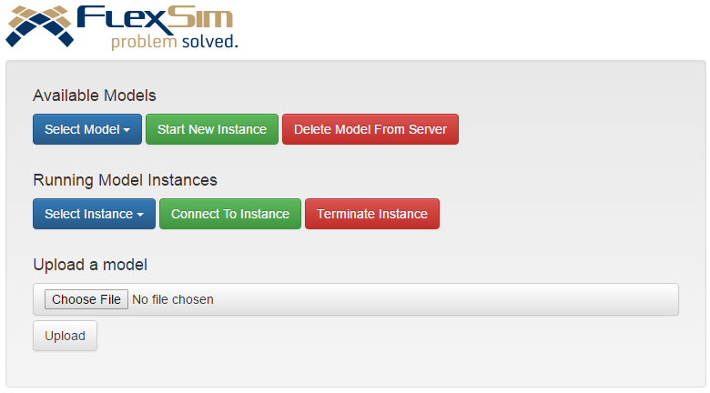 | Overview | tc. The WebServer has its own installer which can be downloaded from within your FlexSim Account. When you start the FlexSim Server using the desktop shortcut, your computer will begin to host a website that looks like this: By default, this website can be accessed by typing the address http://127.0.0.1/ into a browser. ## Configuration The webserver has various settings that can be adjusted in a configuration text f |
| 2 | 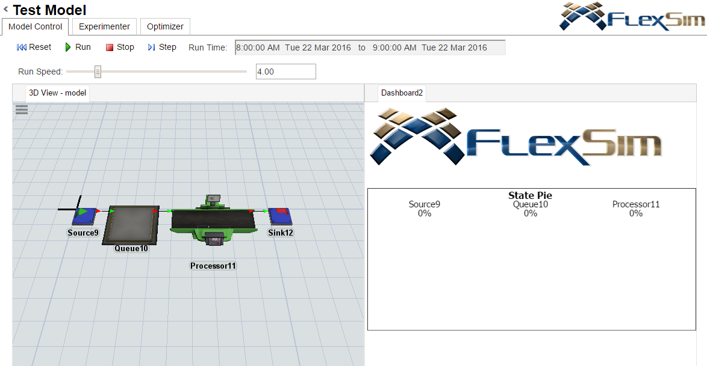 | Key Concepts | **Running Model Instances** will populate with the newly created instance. Select the instance and click **Connect To Instance** to view the automatically generated web interface for your model. Our Test Model had a 3D view and a Dashboard open side by side: The interface that is displayed will match the interface of the model. You can rearrange the interface the same way you interact with FlexSim's windows. Click an |
| 3 | 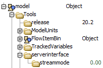 | Streaming Modes | m 2020 Update 2, the default mode is to use WebGL Streaming. You can change this setting individually for each model on the server. To use video streaming, add a streammode node with a value of 0 to your model tree in MODEL:/Tools/serverinterface/streammode. ### Dashboards Dashboards are also displayed in real time. You can even reposition and resize dashboard statistic widgets. If the model's dashboards contain inpu |
| 4 | 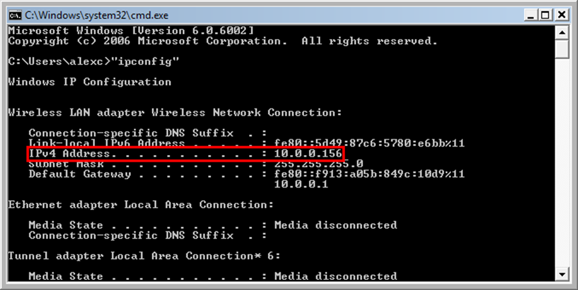 | Tablets and Smartphones | u will need to find the ip address of your computer. To do this, click the start button and type _cmd.exe_, which will open a black command prompt. Enter _ipconfig_ and press enter. Your IPv4 Address should be entered as the URL in the browser in the device. #### Internet Accessibility To use the server on the internet, your computer needs to be assigned a global IP address. Contact your network administrator. ## Dev |
| 5 | 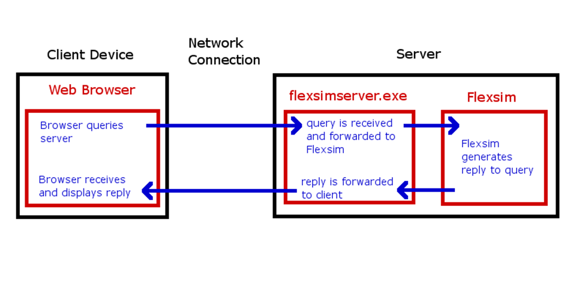 | Instance Queries | iting. ### Instance Queries Once an instance has been created, the webserver can communicate with FlexSim through query handlers. These allow you to both send and receive data from FlexSim. Query requests to the server are handled as seen in this picture: A list of default queries is available at MAIN:/project/exec/globals/serverinterface/queryhandlers. Using these as templates you can create your own custom query ha |
| 6 | 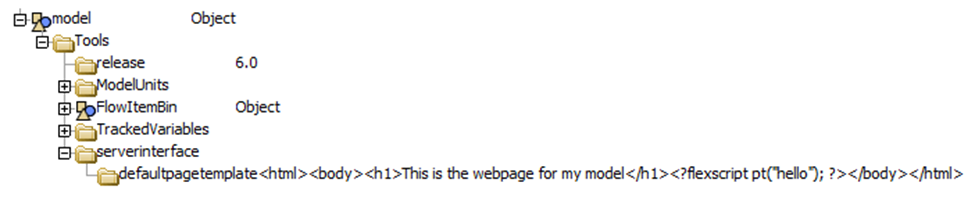 | Default Page | standard html code, but you can escape from the html with a \*\\* tag. You can also override the default html page by putting the html into a node created at MODEL:/Tools/serverinterface/defaultpagetemplate. This will override the default page of the model. You can also generate any named html page in your model. Adding web pages using the Toolbox will put named nodes into MODEL:/Tools/serverinterface/pagetemplates w |
| 7 | 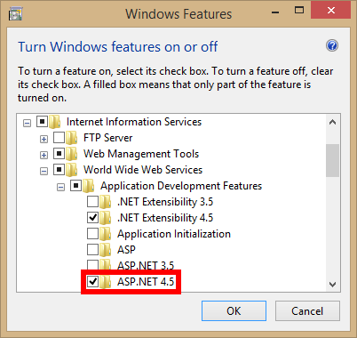 | Configuring IIS | x, click **Internet Information Services** to install the default features. - Expand the **Application Development Features** node (under **World Wide Web Services**) and click **ASP.NET** **4.5** to add the features that support ASP.NET. - Download and install URL Rewrite. - Download and install iisnode. - Make sure that FlexSim is installed in a directory that is accessible by IIS and your models are in a directory |
| 8 | 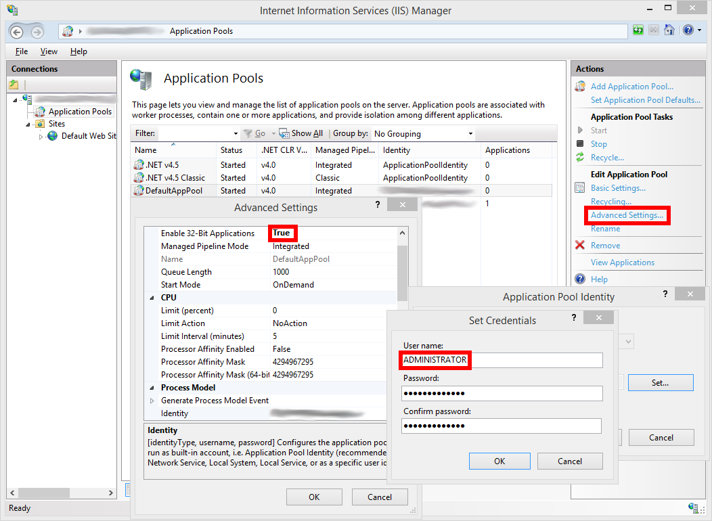 | Configuring IIS | er. - If you are running a 32-bit version of FlexSim, enable 32-bit Applications (otherwise leave this option set to FALSE). - Change the Application Pool Identity to ADMINISTRATOR. There will be many permissions issues avoided by doing this. - To prevent more than one instance of the server running at once, enable **Disable Overlapped Recycle**. - Set **Regular Time Interval (minutes)** to 0. This prevents periodic  |
| 9 | 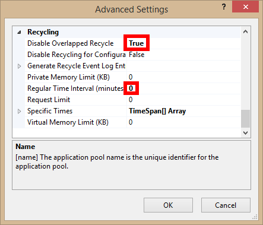 | Configuring IIS | duser/webserver/images/iis_1.png) - To prevent more than one instance of the server running at once, enable **Disable Overlapped Recycle**. - Set **Regular Time Interval (minutes)** to 0. This prevents periodic recycling of the server process. - Go to URL Rewrite under the Default Web Site, still in the IIS Manager. - Click **View Server Variables...** - Click **Add...** and then enter **HTTP\_CONNECTION** into the p |
| 10 | 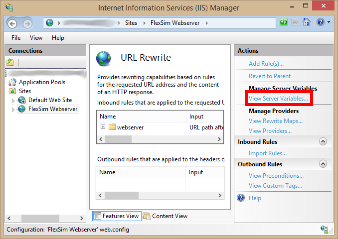 | Configuring IIS | er process. - Go to URL Rewrite under the Default Web Site, still in the IIS Manager. - Click **View Server Variables...** - Click **Add...** and then enter **HTTP\_CONNECTION** into the popup. ### Windows Authentication in IIS Under Sites/Default Web Site, double click on Authentication. Enable Window |
| 11 | 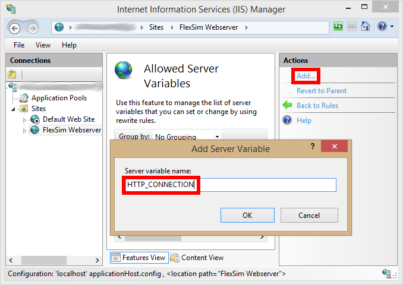 | Configuring IIS | Manager. - Click **View Server Variables...** - Click **Add...** and then enter **HTTP\_CONNECTION** into the popup. ### Windows Authentication in IIS Under Sites/Default Web Site, double click on Authentication. Enable Windows Authentication. ## Using FlexSim Webserver with NGINX Reverse Proxy nginx. |
| 12 | 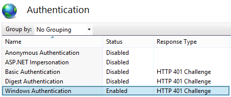 | Windows Authentication in IIS | ### Windows Authentication in IIS Under Sites/Default Web Site, double click on Authentication. Enable Windows Authentication. ## Using FlexSim Webserver with NGINX Reverse Proxy nginx.conf must be configured properly to use the FlexSim Webserver with NGINX. In the following example all requests for 127.0.0.1/model/ are forwarded to 127.0.0.1:8080/. This assumes the FlexSim Webserver is running and bound to port 8080 |

## Extracted Claims

- FlexSim Webserver is a query-driven manager and communication interface that lets users run FlexSim models through a browser. See [[FlexSim Webserver]].
- The Webserver uses a text configuration file for FlexSim program directory, model directory, port, reply timeout, instance limits, thread limits, auto-save filtering, headless mode, remote model operations, job queue limits, Windows Authentication, Active Directory, and session settings.
- The Webserver has higher resource needs than ordinary desktop FlexSim runs because it runs models, renders graphics, compresses and streams graphics/dashboard output, and may serve multiple concurrent users.
- Autodesk does not recommend running FlexSim Webserver in a virtual machine, especially with Video Streaming mode, unless the environment provides suitable 3D graphics acceleration.
- The 3D view supports Video Streaming and WebGL Streaming. FlexSim 2020 Update 2 and later use WebGL Streaming by default.
- Custom integrations use `webserver.dll` queries such as `availablemodels`, `configuration`, `instancelist`, `createinstance`, `queryinstance`, `terminateinstance`, `submitjob`, job status/result queries, library/module listing, and optional upload/download/delete operations.
- Instance-level customization is done through FlexSim query handlers under `MAIN:/project/exec/globals/serverinterface/queryhandlers` or model-level nodes under `MODEL:/Tools/serverinterface/queryhandlers`.
- IIS deployment requires iisnode, IIS Management Tools, ASP.NET, and URL Rewrite. Autodesk calls out visibility, threading, authentication, WebSocket, and desktop heap memory differences.
- NGINX reverse proxy deployment must forward HTTP upgrade headers for WebSockets when proxying to the FlexSim Webserver.

## Candidate Wiki Links

- [[FlexSim Webserver]]

## Processing Notes

- Status: processed
- Firecrawl MCP keyless scrape captured the official page successfully. No dashboard refresh was run.
